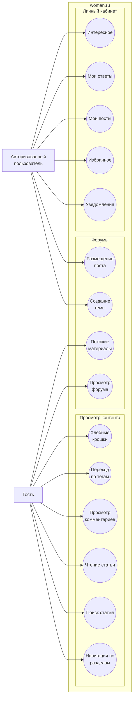
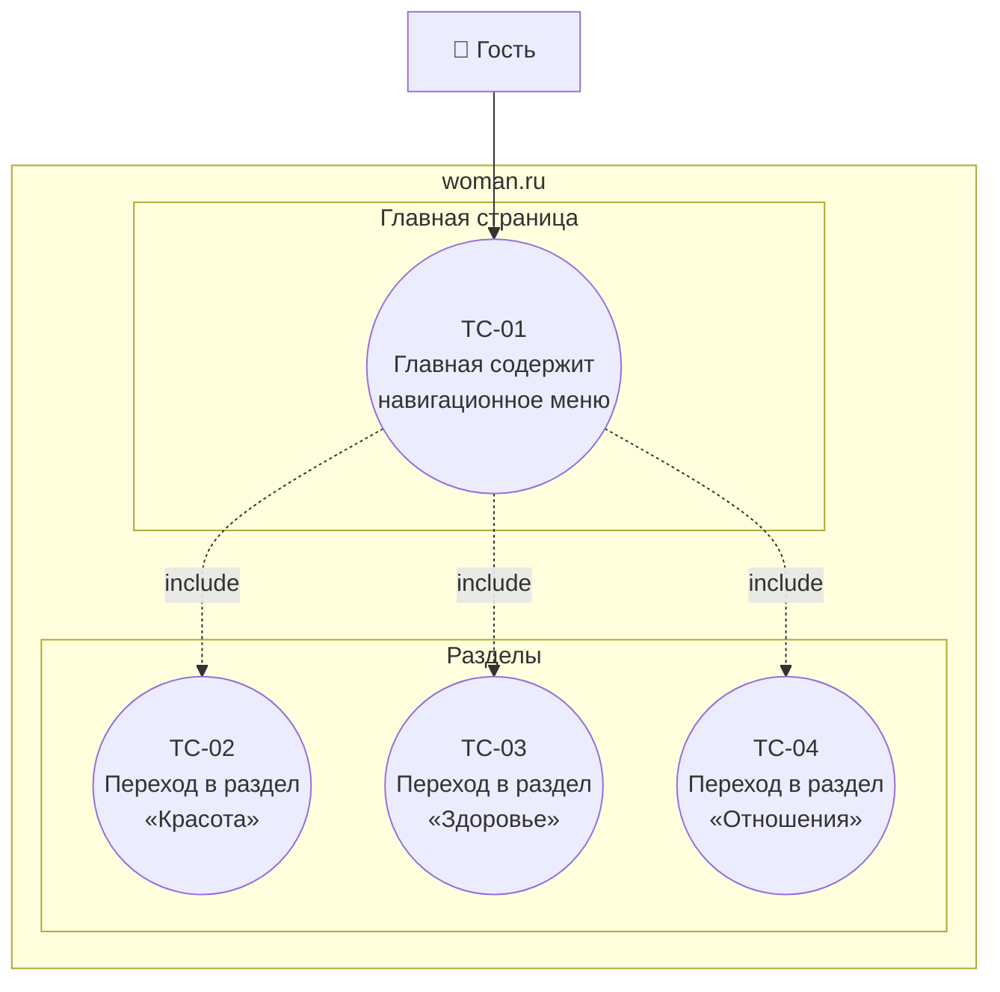
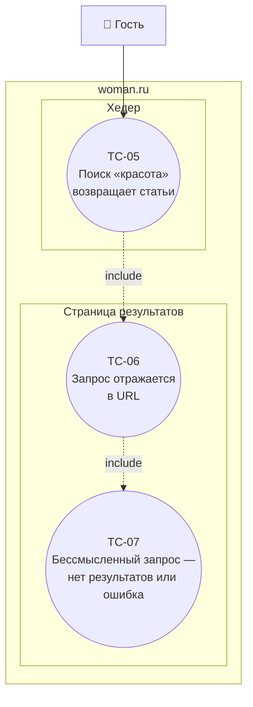
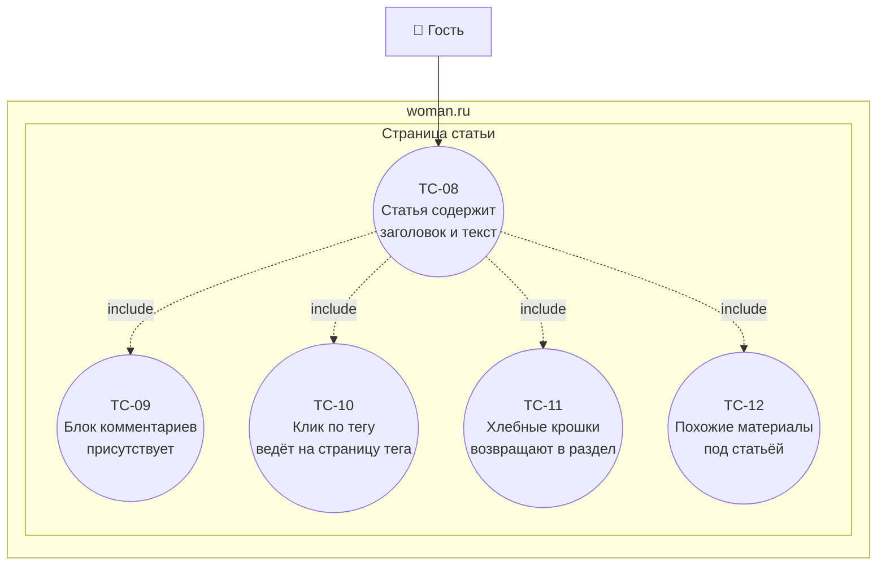
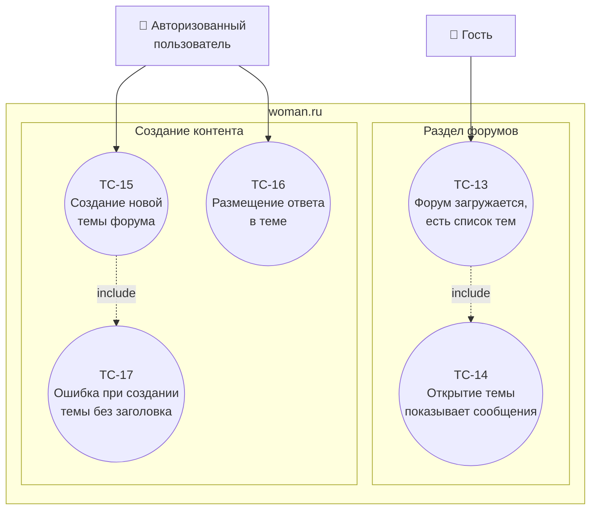
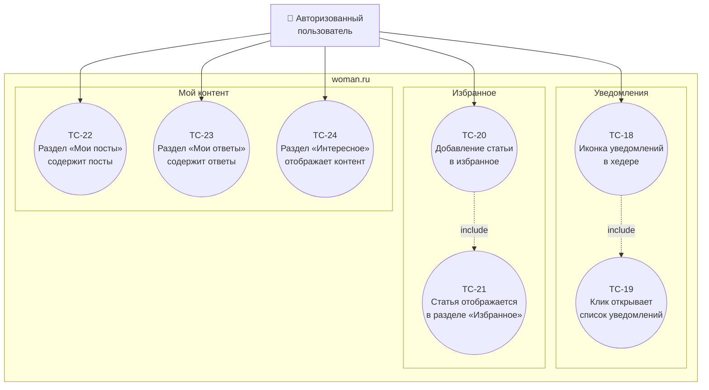

# Use Case Диаграммы — TPO Lab 3: woman.ru

## Общий обзор

---

## NavigationTest — Навигация по разделам

### Тест-кейсы NavigationTest

| ID | Название | Браузеры | Авторизация |
|----|----------|----------|-------------|
| TC-01 | Главная страница содержит навигационное меню | Chrome + Firefox | нет |
| TC-02 | Переход в раздел «Красота» открывает страницу с заголовком раздела | Chrome + Firefox | нет |
| TC-03 | Переход в раздел «Здоровье» открывает страницу с заголовком раздела | Chrome + Firefox | нет |
| TC-04 | Переход в раздел «Отношения» открывает страницу с заголовком раздела | Chrome + Firefox | нет |

---

## SearchTest — Поиск статей

### Тест-кейсы SearchTest

| ID | Название | Браузеры | Авторизация |
|----|----------|----------|-------------|
| TC-05 | Поиск «красота» возвращает список статей | Chrome + Firefox | нет |
| TC-06 | Поисковый запрос «здоровье» отражается в URL результатов | Chrome + Firefox | нет |
| TC-07 | Бессмысленный запрос «xzxzxzxz» показывает пустые результаты или сообщение | Chrome + Firefox | нет |

---

## ArticleTest — Чтение статьи, теги, хлебные крошки

### Тест-кейсы ArticleTest

| ID | Название | Браузеры | Авторизация |
|----|----------|----------|-------------|
| TC-08 | Страница статьи содержит заголовок h1 и непустой текст | Chrome + Firefox | нет |
| TC-09 | На странице статьи присутствует блок комментариев | Chrome + Firefox | нет |
| TC-10 | Клик по тегу под статьёй открывает страницу с материалами по тегу | Chrome + Firefox | нет |
| TC-11 | Клик по разделу в хлебных крошках возвращает на страницу раздела | Chrome + Firefox | нет |
| TC-12 | ❓ Под статьёй отображается блок похожих материалов со ссылками | Chrome + Firefox | нет |

> **TC-12**: нужно проверить на сайте — есть ли блок «Похожие материалы» / «Читайте также» под текстом статьи. Если есть — напиши как называется, допишу XPath.

---

## ForumTest — Форумы

### Тест-кейсы ForumTest

| ID | Название | Браузеры | Авторизация |
|----|----------|----------|-------------|
| TC-13 | Раздел форумов загружается и содержит список тем | Chrome + Firefox | нет |
| TC-14 | Открытие темы форума показывает список сообщений | Chrome + Firefox | нет |
| TC-15 | Авторизованный пользователь может создать тему с заголовком и текстом | Chrome + Firefox | ⚠️ да |
| TC-16 | Авторизованный пользователь может разместить ответ в теме | Chrome + Firefox | ⚠️ да |
| TC-17 | Создание темы без заголовка показывает ошибку валидации | Chrome + Firefox | ⚠️ да |

---

## ProfileTest — Личный кабинет

### Тест-кейсы ProfileTest

| ID | Название | Браузеры | Авторизация |
|----|----------|----------|-------------|
| TC-18 | Иконка уведомлений отображается в хедере после входа | Chrome + Firefox | ⚠️ да |
| TC-19 | Клик по иконке уведомлений открывает список или сообщение «нет уведомлений» | Chrome + Firefox | ⚠️ да |
| TC-20 | Клик «В избранное» на статье меняет состояние кнопки | Chrome + Firefox | ⚠️ да |
| TC-21 | Добавленная статья отображается в разделе «Избранное» профиля | Chrome + Firefox | ⚠️ да |
| TC-22 | Раздел «Мои посты» содержит хотя бы один пост пользователя | Chrome + Firefox | ⚠️ да |
| TC-23 | Раздел «Мои ответы» содержит хотя бы один ответ пользователя | Chrome + Firefox | ⚠️ да |
| TC-24 | ❓ Раздел «Интересное» открывается и содержит список материалов | Chrome + Firefox | ⚠️ да |

> **TC-24**: нужно уточнить на сайте — как называется раздел («Интересное», «Для вас», «Рекомендации»?) и требует ли он авторизации.

---

## Матрица покрытия

| Use Case | Описание | Тест-кейсы | Требует авторизации |
|----------|----------|------------|---------------------|
| UC-01 | Навигация по разделам | TC-01 – TC-04 | нет |
| UC-02 | Поиск статей | TC-05 – TC-07 | нет |
| UC-03 | Чтение статьи | TC-08 | нет |
| UC-04 | Просмотр комментариев | TC-09 | нет |
| UC-05 | Переход по тегам | TC-10 | нет |
| UC-06 | Хлебные крошки | TC-11 | нет |
| UC-10 | Похожие материалы | TC-12 | нет |
| UC-07 | Просмотр форума | TC-13 – TC-14 | нет |
| UC-08 | Создание темы форума | TC-15, TC-17 | ⚠️ да |
| UC-09 | Размещение поста | TC-16 | ⚠️ да |
| UC-11 | Уведомления | TC-18 – TC-19 | ⚠️ да |
| UC-12 | Избранное | TC-20 – TC-21 | ⚠️ да |
| UC-13 | Мои посты | TC-22 | ⚠️ да |
| UC-14 | Мои ответы | TC-23 | ⚠️ да |
| UC-15 | Интересное | TC-24 | ❓ уточнить |
